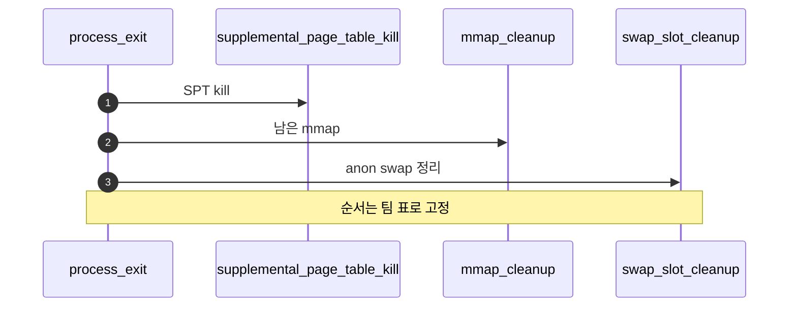

# D – Exit와 전체 Cleanup 안정화

## 1. 개요 (목표·이유·수정 위치·의존성)

```text
목표
- exit, munmap, swap cleanup이 중복 해제 없이 정리되도록 마무리한다.

이유
- Project 3 후반 실패는 기능 구현보다 cleanup 순서와 double free에서 많이 발생한다.

수정/추가 위치
- vm/vm.c
  - supplemental_page_table_kill()
- vm/file.c
  - do_munmap()
  - file_backed_destroy()
- vm/anon.c
  - anon_destroy()

의존성
- A/B/C의 copy 정책과 맞아야 한다.
- Merge 2 cleanup, Merge 3 mmap, Merge 4 swap과 모두 연결된다.
```

## 2. 시퀀스

exit 경로에서 **`supplemental_page_table_kill`**, 남은 **mmap 정리**, **swap 슬롯·frame** 해제 순서를 고정해 **이중 free**를 막는다.



## 3. 단계별 설명 (이 문서 범위)

1. **표준화**: exit 한 곳에서 VM 정리를 모으면 디버깅이 쉽다.
2. **Merge 2·Merge 4**: 이미 만든 destroy·swap_out과 호출 순서가 충돌하지 않게 한다.
3. **회귀 리스트**: 이 폴더 **`00-서론.md` §3** 완료 기준 테스트를 fork+mmap+swap 중심으로 돌린다.

## 4. 구현 주석 가이드

### 4.1 구현 대상 함수 목록

- `supplemental_page_table_kill` (`vm/vm.c`)
- `do_munmap` (`vm/file.c`)
- `anon_destroy` / `file_backed_destroy` / `uninit_destroy`
- (연결) `process_exit` cleanup 호출 순서

### 4.2 공통 구조체/필드 계약

- exit cleanup은 단일 진입점에서 순서를 고정한다.
- destroy/munmap/swap 정리는 중복 호출되지 않게 역할을 분리한다.
- A/B/C에서 만든 복사 정책과 충돌하지 않아야 한다.

### 4.3 함수별 구현 주석 (고정안)

#### exit cleanup 통합 경로

**추상**

```c
/* Merge5-D: process_exit에서 VM 자원 정리 순서를 고정해 double free 없이 SPT/mmap/swap/frame을 회수한다. */
```

**1단계 구체**

- kill 경로에서 SPT 엔트리 순회 + destroy.
- 남은 mmap 매핑 정리(write-back 포함).
- anon swap 슬롯과 frame 링크를 누수 없이 해제.

**2단계 구체**

1. exit 진입 시 VM cleanup 함수 호출.
2. `supplemental_page_table_kill`로 SPT 기반 정리.
3. mmap 잔여 구간이 있으면 `do_munmap` 경로 실행.
4. 타입별 destroy에서 중복 해제 가드 확인.
5. 종료 시 VM 관련 리스트/해시가 비어 있는지 보장.
6. **하지 않음**: 새로운 페이지 생성, fork copy 수행.

### 4.4 함수 간 연결 순서 (호출 체인)

1. `process_exit`가 D의 cleanup 통합 경로를 호출한다.
2. SPT kill → mmap 정리 → swap/frame 잔여 정리 순으로 진행한다.
3. 마지막에 스레드/프로세스 종료로 반환한다.

### 4.5 실패 처리/롤백 규칙

- cleanup은 best-effort 원칙으로 중단보다 일관 정리를 우선한다.
- 실패 로깅이 있더라도 같은 자원을 두 번 해제하지 않게 가드한다.
- D 범위에서는 새 정책(COW/eviction)을 추가하지 않는다.

### 4.6 완료 체크리스트

- exit 후 VM 자원 누수가 없다.
- double free/이중 close가 발생하지 않는다.
- fork+mmap+swap 회귀 케이스가 안정적으로 종료된다.
